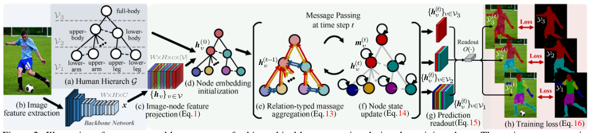

# Hierarchical Human Parsing with Typed Part-Relation Reasoning (CVPR2020)

## Introduction
The algorithm is described in the [CVPR 2020 paper: Hierarchical Human Parsing with Typed Part-Relation Reasoning](https://openaccess.thecvf.com/content_CVPR_2020/papers/Wang_Hierarchical_Human_Parsing_With_Typed_Part-Relation_Reasoning_CVPR_2020_paper.pdf). 


***

## Environment and installation
This repository is developed under **CUDA-10.0** and **pytorch-1.2.0** in **python3.6**. The required packages can be installed by:
```bash
pip install -r requirements.txt
```

## Structure of repo
````bash
$HierarchicalHumanParsing
├── checkpoints
│   ├── init
├── dataset
│   ├── list
├── doc
├── inplace_abn
│   ├── src
├── modules
├── network
├── utils
````

## Running the code
```bash
python evaluate_pascal.py
```

***
## Citation
If you find this code useful, please cite the related work with the following bibtex:
```
@InProceedings{Wang_2020_CVPR,
author = {Wang, Wenguan and Zhu, Hailong and Dai, Jifeng and Pang, Yanwei and Shen, Jianbing and Shao, Ling},
title = {Hierarchical Human Parsing With Typed Part-Relation Reasoning},
booktitle = {IEEE/CVF Conference on Computer Vision and Pattern Recognition (CVPR)},
month = {June},
year = {2020}
}

@InProceedings{Wang_2019_ICCV,
author = {Wang, Wenguan and Zhang, Zhijie and Qi, Siyuan and Shen, Jianbing and Pang, Yanwei and Shao, Ling},
title = {Learning Compositional Neural Information Fusion for Human Parsing},
booktitle = {Proceedings of the IEEE/CVF International Conference on Computer Vision (ICCV)},
month = {October},
year = {2019}
}
```
